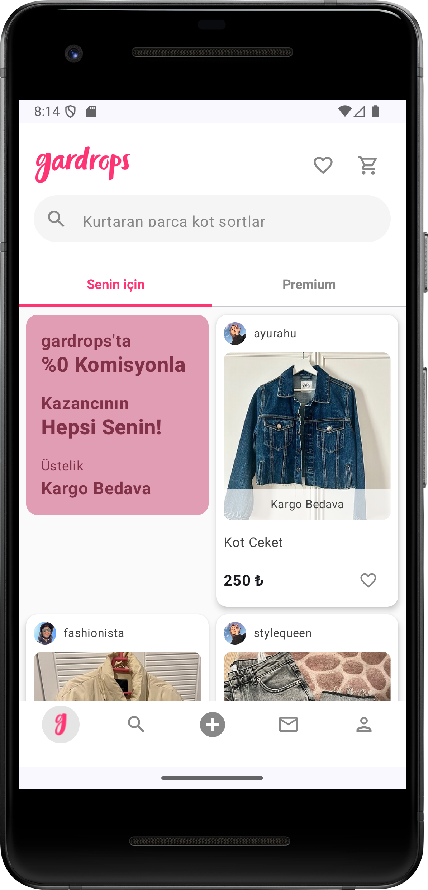
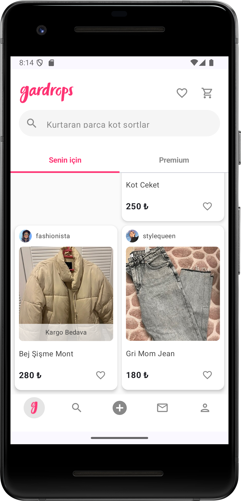

# Gardropsapp
<!-- Language Navigation -->

<a href="#-english">🇺🇸 English</a> | <a href="#-türkçe">🇹🇷 Türkçe</a>

🛍️ Gardrops UI Clone - Jetpack Compose

This project is an Android application developed as part of a Jetpack Compose Bootcamp, simulating the user interface design and basic user interactions of the popular second-hand shopping app, Gardrops.

It is written in 100% Kotlin and Jetpack Compose, adhering to modern Android development standards.

📱 Screenshots

Home & Feed

Product Detail & Cart

🌟 Features

The application operates with local data (no API connection) and supports the following scenarios:

Product Listing: Displaying saved products on the home page with a stylish interface.

Search: Dynamic search functionality among products.

Favorites: Adding/removing liked products to/from the favorites list.

Cart Management: Simulation of adding products to the shopping cart.

Detail Page: Viewing product descriptions, prices, and user comments.

Categories: Switching between categories like "For You" (Senin İçin) and "Premium".

🛠️ Tech Stack & Architecture

The project is built on the MVVM (Model-View-ViewModel) architecture to ensure sustainable and testable code.

Language: Kotlin

UI Framework: Jetpack Compose

Architecture: MVVM (Model - View - ViewModel)

Navigation: Jetpack Navigation Component

Data Management: Repository Pattern & Local Dummy Data

📂 Project Structure

A clean folder structure is maintained as shown below:

com.zsd.gardropsapp
├── data
│   ├── entity (Models)
│   └── repository (Data Logic)
├── ui
│   ├── components (Reusable UI parts)
│   ├── navigation (NavHost)
│   ├── screens (Feature Screens)
│   └── theme (Colors, Type)

🚀 Installation & Setup

To run this project on your local machine:

Clone the repository:

git clone [https://github.com/zeysdzl/Gardropsapp.git](https://github.com/zeysdzl/Gardropsapp.git)

Open Android Studio and select Open to choose the project folder.

Wait for the Gradle synchronization to finish.

Select an emulator or physical device and press the Run (▶️) button.

👩‍💻 Developer

Zeynep - GitHub Profile

This project is developed for educational purposes and is not an official product of Gardrops application.

🛍️ Gardrops UI Clone - Jetpack Compose (Türkçe)

Bu proje, Jetpack Compose Bootcamp kapsamında geliştirilmiş, popüler ikinci el alışveriş uygulaması Gardrops'un arayüz tasarımını ve temel kullanıcı etkileşimlerini simüle eden bir Android uygulamasıdır.

Modern Android geliştirme standartlarına uygun olarak %100 Kotlin ve Jetpack Compose kullanılarak yazılmıştır.

📱 Ekran Görüntüleri

Ana Sayfa & Akış

Ürün Detay & Sepet

🌟 Özellikler

Uygulama, API bağlantısı olmadan yerel (local) verilerle çalışır ve şu senaryoları destekler:

Ürün Listeleme: Kayıtlı ürünlerin ana sayfada şık bir arayüzle görüntülenmesi.

Arama (Search): Ürünler arasında dinamik arama yapabilme.

Favoriler: Beğenilen ürünleri favori listesine ekleme/çıkarma.

Sepet Yönetimi: Ürünleri sepete ekleme simülasyonu.

Detay Sayfası: Ürün açıklamalarını, fiyatını ve kullanıcı yorumlarını görüntüleme.

Kategoriler: "Senin İçin", "Premium" gibi kategori geçişleri.

🛠️ Teknolojiler & Mimari

Proje, sürdürülebilir ve test edilebilir kod yazımı için MVVM (Model-View-ViewModel) mimarisi üzerine kurulmuştur.

Dil: Kotlin

UI Framework: Jetpack Compose

Mimari: MVVM (Model - View - ViewModel)

Navigasyon: Jetpack Navigation Component

Veri Yönetimi: Repository Pattern & Local Dummy Data

📂 Proje Yapısı

Ekran görüntülerinde görüldüğü üzere temiz bir klasör yapısı kullanılmıştır:

com.zsd.gardropsapp
├── data
│   ├── entity (Models)
│   └── repository (Data Logic)
├── ui
│   ├── components (Reusable UI parts)
│   ├── navigation (NavHost)
│   ├── screens (Feature Screens)
│   └── theme (Colors, Type)

🚀 Kurulum ve Çalıştırma

Bu projeyi kendi bilgisayarında çalıştırmak için şu adımları izleyebilirsin:

Projeyi klonlayın:

git clone [https://github.com/zeysdzl/Gardropsapp.git](https://github.com/zeysdzl/Gardropsapp.git)

Android Studio'yu açın ve Open diyerek projeyi seçin.

Gradle senkronizasyonunun bitmesini bekleyin.

Bir emülatör veya fiziksel cihaz seçerek Run (▶️) tuşuna basın.

👩‍💻 Geliştirici

Zeynep - GitHub Profilim

Bu proje eğitim amaçlı geliştirilmiştir ve Gardrops uygulamasının resmi bir ürünü değildir.

